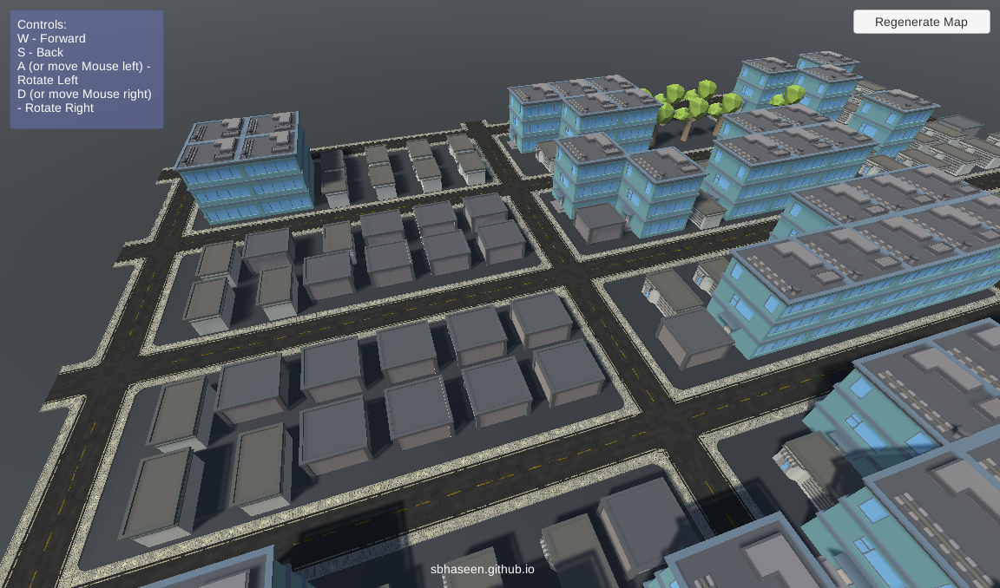
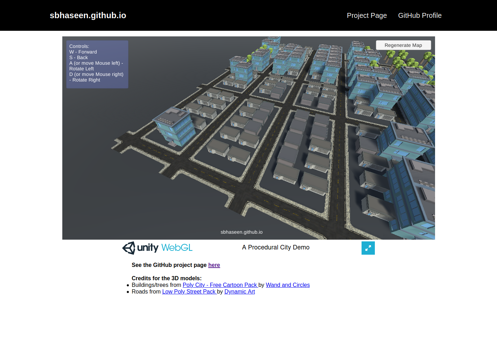
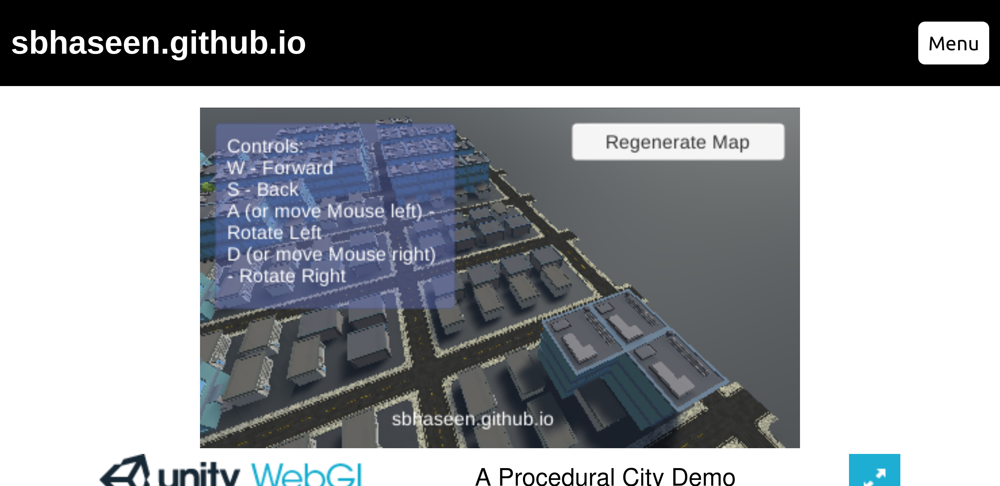

# A Procedural City Demo

---

This repository is now archieved and no longer maintained. It may no longer function as originally intended due to deprecations.

---

A procedural generation demo of a city in Unity.

---

City building is one of my favorite genres, so I decided to experiment with a procedurally generated city. While there are a lot of basic tutorials out there, nothing really matched what I had in mind, so I got into the mathematics of procedural generation and Unity engine documentation. I chose to use the Unity game engine because of readily available documentation and ease of scripting with C#.

Read the blog post for more details [here](https://sbhaseen.github.io/2018/11/26/Procedural_game_basics.html).

Some essential references from the Unity documentation:

- [Instantiating Prefabs](https://docs.unity3d.com/Manual/InstantiatingPrefabs.html)
- [Game Objects](https://docs.unity3d.com/ScriptReference/GameObject.html)
- [Perlin Noise](https://docs.unity3d.com/ScriptReference/Mathf.PerlinNoise.html)

Credits for the 3D models:

- Buildings/trees from [Poly City - Free Cartoon Pack](https://assetstore.unity.com/packages/3d/poly-city-free-cartoon-pack-95242) by [Wand and Circles](https://assetstore.unity.com/publishers/26567)
- Roads from [Low Poly Street Pack](https://assetstore.unity.com/packages/3d/environments/urban/low-poly-street-pack-67475) by [Dynamic Art](https://assetstore.unity.com/publishers/21977)

---

## Screenshots:

In game

Web page

Web page on mobile

